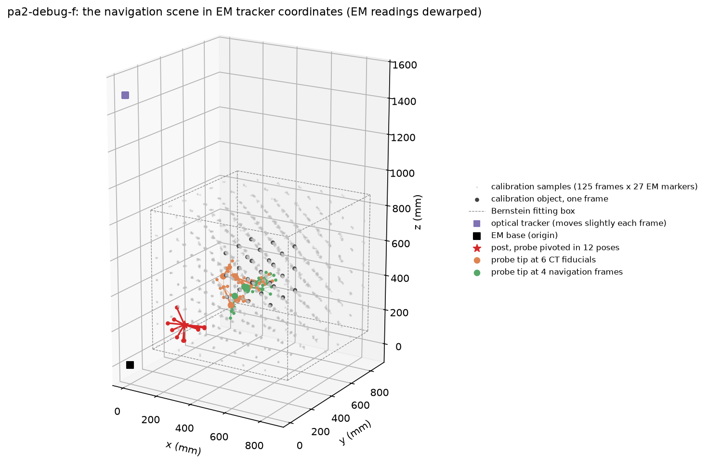
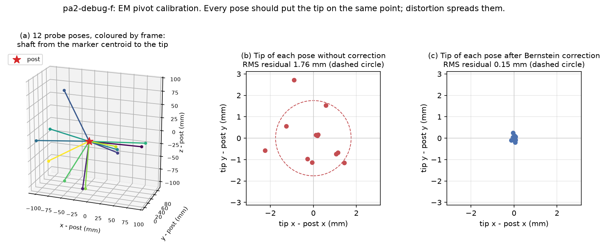
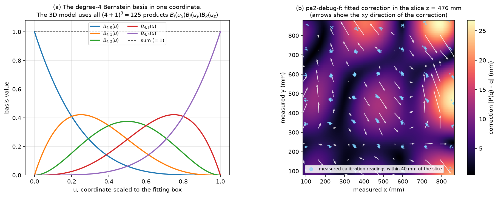
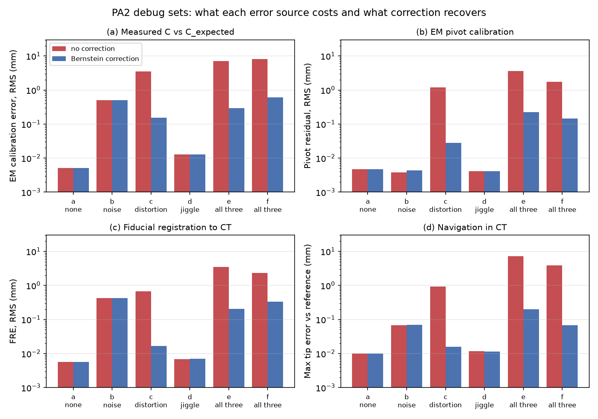
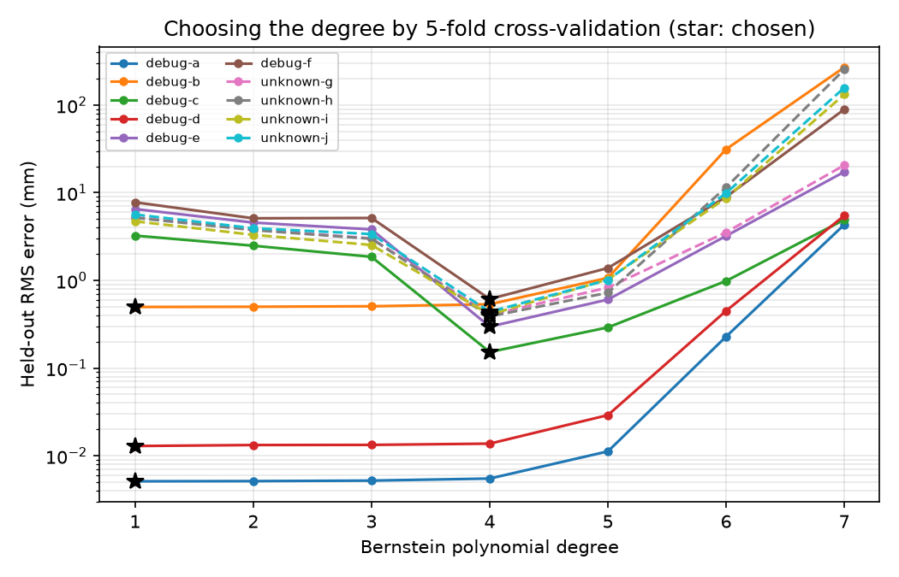
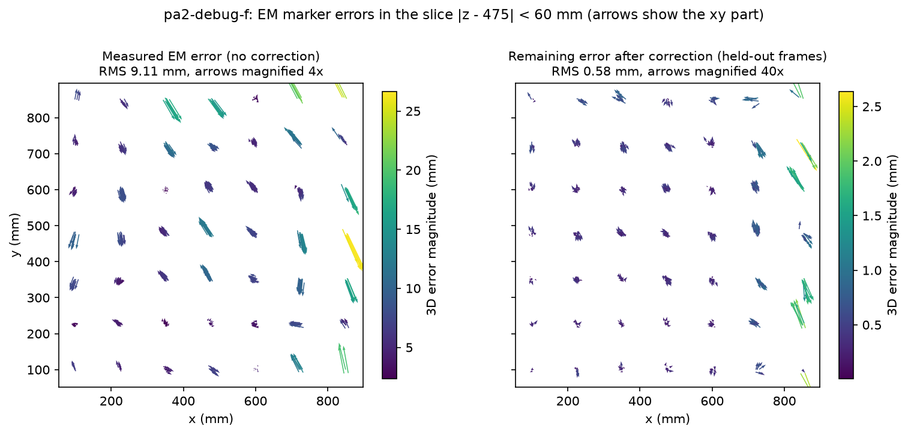
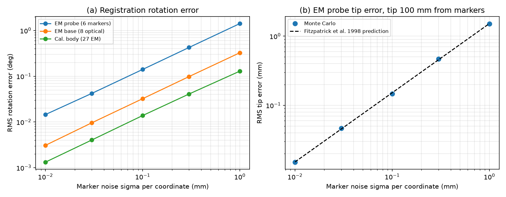
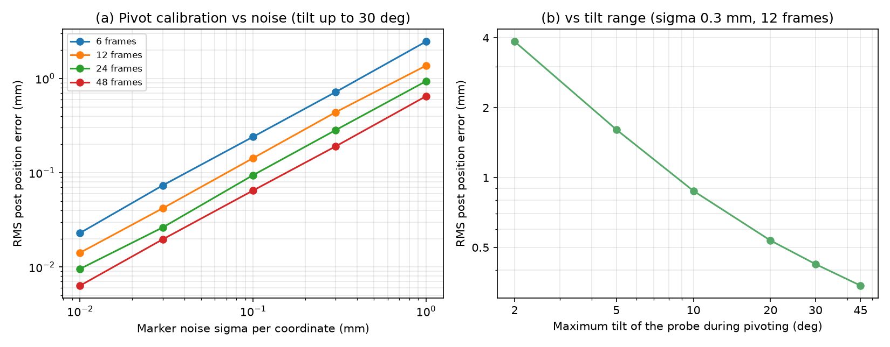

# Introduction

This report describes my implementation of Programming Assignments 1 and 2 of
CIS I. A simulated stereotactic navigation system has an electromagnetic (EM)
tracker with a large, repeatable distortion and some noise, an accurate optical
tracker that jiggles on its tripod, a calibration object carrying both EM
markers and optical LEDs, a dimpled post, and two pointer probes (one EM, one
optical). PA1 builds the basic tools (frames, point-set registration, pivot
calibration) and computes where the EM markers *should* have been measured.
PA2 uses those expected positions to fit and remove the EM distortion, then
registers the EM tracker to a CT image and reports the probe tip in CT
coordinates. Figure 1 shows the whole scene as the program reconstructs it.

{width=78%}

The code is in Python (package `cisnav`), uses NumPy and SciPy only for linear
algebra, and is checked by 506 automated tests and by comparison with every
debug data set. The registration and calibration routines are written from
scratch, as the course rules require.

# Mathematical approach

**Notation.** A frame $F = [R, \vec p]$ maps a point $\vec b$ to
$F\vec b = R\vec b + \vec p$, with $R$ a rotation ($R^TR = I$, $\det R = +1$).
Frames compose as $F_1F_2 = [R_1R_2,\ R_1\vec p_2 + \vec p_1]$ and invert as
$F^{-1} = [R^T, -R^T\vec p]$. $F_{AB}$ maps coordinates in frame $B$ into frame
$A$.

## Point-set to point-set registration

Given corresponding points $\vec a_i$ and $\vec b_i$, $i = 1..N$, find $F$
minimising $\sum_i \lVert R\vec a_i + \vec p - \vec b_i\rVert^2$. I use the
SVD method of Arun, Huang and Blostein (1987) with the reflection correction
of Umeyama (1991).

1. *Translation.* Setting the derivative with respect to $\vec p$ to zero gives
   $\vec p = \bar b - R\bar a$, where $\bar a, \bar b$ are the centroids. With
   centred points $\tilde a_i = \vec a_i - \bar a$ and
   $\tilde b_i = \vec b_i - \bar b$ only the rotation is left.
2. *Rotation.* Expanding the squared norm, $\sum\lVert R\tilde a_i - \tilde b_i\rVert^2
   = \sum\lVert\tilde a_i\rVert^2 + \sum\lVert\tilde b_i\rVert^2 - 2\,\mathrm{tr}(RH)$
   with $H = \sum_i \tilde a_i\tilde b_i^T$. Minimising the error is maximising
   $\mathrm{tr}(RH)$.
3. *SVD.* Write $H = USV^T$. Then $\mathrm{tr}(RH) = \mathrm{tr}(MS)$ with
   $M = V^TRU$ orthogonal, and $\mathrm{tr}(MS) = \sum_k M_{kk}s_k \le \sum_k s_k$,
   with equality at $M = I$, that is $R = VU^T$.
4. *Reflection.* If $\det(VU^T) = -1$ (possible with noisy or planar data), that
   matrix is a reflection. The best proper rotation flips the term with the
   smallest singular value, which costs least:
   $R = V\,\mathrm{diag}(1, 1, \det(VU^T))\,U^T$.

The routine rejects fewer than 3 points and collinear or coincident sets
(second singular value near zero), where the rotation about the line is
undetermined. Horn's (1987) unit-quaternion method solves the same problem and
would give the same answer; I implemented only the SVD form.

## Pivot calibration

While the probe tip sits in a dimple and the body is swung around it, the
tracker reports poses $F_k = [R_k, \vec p_k]$, $k = 1..K$. The tip offset
$\vec t$ (probe coordinates) and the dimple $\vec P$ (tracker coordinates) are
fixed, so every frame satisfies $R_k\vec t + \vec p_k = \vec P$, or

$$
\begin{bmatrix} R_k & -I \end{bmatrix}
\begin{bmatrix} \vec t \\ \vec P \end{bmatrix} = -\vec p_k .
$$

Stacking all frames gives a $3K\times 6$ linear system that I solve by linear
least squares (`numpy.linalg.lstsq`). The poses come from registration,
$F_k$ = register($\vec g$, $\vec G[k]$), against a centred probe model
$\vec g$. The handout suggests the first frame's markers minus their
centroid, $\vec g_j = \vec G_{j}[1] - \bar G[1]$. That is exact for a rigid
probe, but distorted EM readings change the marker shape from frame to frame,
and the post then depends on which frame happens to come first. I use the
generalized Procrustes mean instead: align every frame to the current
estimate, average, recentre and repeat, starting from the first frame. For
rigid readings this gives the same $\vec g$; for distorted ones every frame
counts equally and the result no longer depends on the frame order (a unit
test checks both).
The system has full rank only if the probe rotates about at least two
different axes. With rotation about a single axis the tip and post offsets
along that axis cannot be separated (a unit test checks this rank loss).
Figure 2 shows a real pivot set: the per-frame tips scatter by 1.76 mm RMS
on distorted readings and by 0.15 mm once they are dewarped (PA2).

{width=100%}

## Expected EM marker positions (PA1)

For each calibration frame, $F_D$ = register($\vec d$, $\vec D$) is the pose of
the EM base in optical tracker coordinates and $F_A$ = register($\vec a$, $\vec A$)
the pose of the calibration object. Chaining them gives the object pose in EM
coordinates, and so where an ideal EM tracker would see the EM markers:
$\vec C^{exp}_i = F_D^{-1}F_A\,\vec c_i$.

For the optical probe, the optical tracker may move between frames, so each
frame's readings are first expressed in EM coordinates with that frame's own
$F_D$: $\vec H^{EM}_j = F_D^{-1}\vec H_j$. Pivot calibration on
$\vec H^{EM}$ then gives the post in EM coordinates.

## Distortion correction (PA2)

The EM distortion is smooth and repeatable, so it is modelled by a polynomial
$P$ that maps measured positions $\vec q$ to true positions:
$P(\vec C) \approx \vec C^{exp}$.

* *Scaling.* Each coordinate is mapped to $[0,1]$ with the bounding box of the
  calibration readings: $u = (q - q_{min})/(q_{max} - q_{min})$. The box does not
  change the fitted function (an affine change of variables maps degree-$N$
  polynomials onto themselves); it only keeps the basis well conditioned.
* *Basis.* The Bernstein polynomials $B_{N,k}(u) = \binom{N}{k}u^k(1-u)^{N-k}$,
  combined as the tensor product
  $F_{ijk}(\vec u) = B_{N,i}(u_x)B_{N,j}(u_y)B_{N,k}(u_z)$, give $(N+1)^3$
  basis functions.
* *Fit.* Each of the $125 \times 27 = 3375$ calibration points gives one row of
  basis values; the coefficient matrix $c$ ($(N+1)^3 \times 3$) solves
  $Fc \approx C^{exp}$ in the least-squares sense, one `lstsq` call for all
  three output coordinates.
* *Degree.* Too low a degree cannot follow the distortion; too high a degree
  fits noise and oscillates between samples and near the edges. I choose $N$
  by 5-fold cross-validation, holding out whole calibration frames, and take
  the smallest degree within 5% of the best held-out error. This uses only the
  calibration data, never the answer files.

Figure 3 shows the degree-4 basis and the fitted correction in a slice of
the calibration volume of pa2-debug-f: a smooth field of about 7 mm in the
middle that grows to 27 mm at the edges.

{width=100%}

## Registration to CT and navigation (PA2)

After dewarping the pivot readings and repeating the pivot calibration, each
fiducial frame gives the tip in EM coordinates,
$\vec B_j = F_G[j]\,\vec t$, where $F_G[j]$ is the registration of the probe
model to the dewarped readings. Then $F_{reg}$ = register($\vec B$, $\vec b$)
maps EM to CT. For each navigation frame the tip in CT is
$\vec v_k = F_{reg}F_G[k]\,\vec t$.

# Algorithm steps

**PA1**, for each data set:

1. Read the calibration body, calibration readings, EM pivot and optical pivot
   files.
2. For every calibration frame compute $F_D$, $F_A$ and
   $\vec C^{exp} = F_D^{-1}F_A\vec c$.
3. EM pivot: define $\vec g$ from frame 1, register every frame, solve the
   stacked system for $\vec t_G$ and $\vec P$.
4. Optical pivot: map $\vec H$ into EM coordinates with each frame's $F_D$,
   then pivot as in step 3.
5. Write `NAME-output1.txt`: header, EM post, optical post, all $\vec C^{exp}$.

**PA2**, for each data set:

1. Compute $\vec C^{exp}$ for all 125 calibration frames (PA1 step 2).
2. Choose the degree by cross-validation, then fit the Bernstein correction
   $P$ to all frames.
3. Dewarp the EM pivot readings with $P$ and repeat the pivot calibration.
4. Dewarp the fiducial readings and compute the tip positions $\vec B_j$.
5. Compute $F_{reg}$ from $\vec B_j$ and the CT fiducials $\vec b_j$.
6. Dewarp each navigation frame, compute the tip, map it with $F_{reg}$ and
   write `NAME-output2.txt`. A PA2 `output1` with the dewarped EM post is also
   written when the optical pivot file exists.

# Program overview

| Module | Purpose |
|---|---|
| `cisnav/io.py` | Readers for every input file; header-tolerant, checks row counts |
| `cisnav/frames.py` | Rotations (axis-angle, quaternion) and the `Frame` class |
| `cisnav/registration.py` | SVD point-set registration with reflection fix |
| `cisnav/pivot.py` | Stacked least-squares pivot calibration |
| `cisnav/distortion.py` | Bernstein basis, correction fit, cross-validation |
| `cisnav/pa1.py` | PA1 steps and command line tool |
| `cisnav/pa2.py` | PA2 steps and command line tool |
| `cisnav/output.py` | Output writers in the handout format |
| `scripts/compare_debug.py` | Validation against the debug outputs |
| `scripts/error_sources.py`, `scripts/monte_carlo.py` | Error analysis and figures |
| `scripts/geometry_figures.py` | Figures of the scene, pivot and correction |

The modules form layers: `frames` has no dependencies, `registration` uses
`frames`, `pivot` uses `registration`, and the `pa1` and `pa2` pipelines only
combine these building blocks with the readers and writers. Every step is a
small function with a docstring that states its equation, so each can be
tested on its own. Usage:

```
pip install -e ".[dev]"
python -m cisnav.pa1 --data-dir data/pa1 --set all --out output/
python -m cisnav.pa2 --data-dir data/pa2 --set all --out output/
python scripts/compare_debug.py --assignment pa2
```

Libraries: NumPy (Harris et al. 2020) for arrays, SVD (`linalg.svd`) and
least squares (`linalg.lstsq`), both backed by LAPACK; SciPy (Virtanen et al.
2020) for binomial coefficients; Matplotlib (Hunter 2007) for figures; pytest
for tests. No registration or calibration library was used.

# Validation

Validation has two layers.

**Unit tests on synthetic data with known answers** (506 tests, run on every
push by GitHub Actions). Examples: exact recovery of random frames by
registration, including planar point sets and a mirrored data set that tempts
the unconstrained SVD into a reflection; least-squares optimality (any small
rotation of the solution increases the residual); residual size under noise
matching the expected $\sigma\sqrt{(3N-6)/N}$; exact pivot recovery and rank
loss under single-axis rotation; exact recovery of a cubic correction by a
degree-3 fit and sub-0.01 mm correction of a smooth non-polynomial warp on
held-out points; cross-validation recovering the true degree; and readers
loading all 132 data files with counts checked against their headers.

**Debug sets.** Each debug set switches on one error source, so a mismatch
points to its cause. All values below are 3D distances in mm; both our files
and the reference files are rounded to 0.01 mm.

| PA1 set | Sources on | $C^{exp}$ max | $C^{exp}$ RMS | EM post | Optical post |
|---|---|---|---|---|---|
| a | none | 0.017 | 0.005 | 0.000 | 0.000 |
| b | noise | 0.751 | 0.491 | 0.000 | 0.000 |
| c | distortion | 0.953 | 0.403 | 0.000 | 0.000 |
| d | jiggle | 0.024 | 0.012 | 0.000 | 0.000 |
| e | distortion, jiggle | 3.741 | 1.710 | 0.010 | 0.000 |
| f | all three | 4.282 | 1.788 | 0.010 | 0.010 |
| g | all three | 3.359 | 1.680 | 0.010 | 0.000 |

Both pivot calibrations match all seven sets to rounding. $C^{exp}$ matches
in a and d, where the EM tracker has no error. In the other sets the reference
$C^{exp}$ itself contains EM-side error: in set b it is identical, digit for
digit, to the measured noisy EM readings, and in c, e, f and g it is not a
rigid image of the calibration body (rigid-fit residual 0.46 to 2.1 mm per
frame, against 0.005 mm for ours). Since $F_D^{-1}F_A\vec c$ depends only on
optical data, which has no EM error, I did not change the program to chase
these values. The analysis is in `results/pa1_validation.md`.

| PA2 set | Sources on | Degree | FRE RMS | Tip max | Tip RMS | Dewarped EM post |
|---|---|---|---|---|---|---|
| a | none | 1 | 0.006 | 0.014 | 0.009 | 0.004 |
| b | noise | 1 | 0.420 | 0.065 | 0.048 | 0.176 |
| c | distortion | 4 | 0.016 | 0.017 | 0.013 | 0.004 |
| d | jiggle | 1 | 0.007 | 0.014 | 0.010 | 0.003 |
| e | all three | 4 | 0.204 | 0.197 | 0.154 | 0.006 |
| f | all three | 4 | 0.329 | 0.064 | 0.054 | 0.007 |

Navigation matches to rounding in a, c and d. Set c is the real test of the
distortion correction: the raw EM pivot residual there is 1.2 mm and the
dewarped one 0.03 mm. In set b the dewarped post differs by 0.18 mm; forcing
degree 4 reproduces the reference to 0.006 mm, so the reference most likely
used degree 4 everywhere. Set b has no distortion and noise-free pivot
readings, so its plain pivot is the true post; our degree-1 result is 0.03 mm
from it, the reference 0.18 mm. In e and f the tip differences (up to 0.2 mm)
remain although the degree and the post agree with the reference, and are
the size of the EM noise effect on single fiducial and navigation readings
(FRE 0.20 and 0.33 mm). Details are in `results/pa2_validation.md`.

# Results for the unknown data sets

**PA1** (EM coordinates, mm). The pivot residual is the RMS of
$\lVert R_k\vec t + \vec p_k - \vec P\rVert$ over frames.

| Set | EM post | EM pivot RMS | Optical post | Optical pivot RMS |
|---|---|---|---|---|
| h | 209.47, 195.41, 217.00 | 6.21 | 394.59, 399.97, 192.83 | 0.008 |
| i | 206.29, 200.55, 194.22 | 2.55 | 404.07, 398.23, 203.91 | 0.008 |
| j | 191.07, 190.53, 210.24 | 1.06 | 397.66, 408.18, 202.79 | 0.004 |
| k | 191.10, 201.09, 187.52 | 2.08 | 402.19, 403.11, 197.89 | 0.007 |

**PA2.** Degree and held-out calibration error from cross-validation, pivot
RMS after dewarping, FRE of $F_{reg}$ and the dewarped EM post (mm):

| Set | Degree | CV error | Pivot RMS | FRE | Dewarped EM post |
|---|---|---|---|---|---|
| g | 4 | 0.405 | 0.084 | 0.045 | 204.84, 205.46, 190.78 |
| h | 4 | 0.388 | 0.103 | 0.177 | 193.43, 209.38, 200.68 |
| i | 4 | 0.408 | 0.140 | 0.136 | 195.80, 210.00, 192.44 |
| j | 4 | 0.438 | 0.089 | 0.238 | 192.21, 196.20, 192.79 |

Probe tip positions in CT coordinates (mm), the contents of `output2`:

| Frame | g | h |
|---|---|---|
| 1 | 111.86, 75.83, 148.57 | 116.55, 63.62, 146.84 |
| 2 | 85.56, 143.10, 75.27 | 42.11, 164.77, 72.88 |
| 3 | 76.58, 47.66, 92.43 | 66.43, 107.50, 61.56 |
| 4 | 65.91, 80.82, 26.43 | 41.37, 140.69, 26.82 |

| Frame | i | j |
|---|---|---|
| 1 | 63.74, 91.59, 108.97 | 143.12, 114.10, 59.86 |
| 2 | 106.37, 165.62, 42.22 | 96.88, 33.88, 114.63 |
| 3 | 73.77, 145.75, 122.45 | 134.03, 41.27, 109.16 |
| 4 | 50.04, 87.77, 88.77 | 126.36, 46.95, 117.73 |

# Discussion

**What each error source costs.** Figure 4 runs the PA2 pipeline on every
debug set with and without the correction. *Jiggle* (set d) costs nothing,
because every optical reading is mapped through its own frame's $F_D$.
*Noise* (set b) sets a floor that no correction removes: about 0.5 mm RMS in
the calibration readings and 0.42 mm FRE. *Distortion* dominates: in set c it
raises the navigation error to 0.93 mm, and in set e, combined with the other
sources, to 7.3 mm. The correction brings these to 0.016 mm and 0.20 mm. The
unknown sets behave like the worst debug sets (raw calibration error 5.3 to
6.3 mm, held-out error after correction about 0.4 mm), and their FRE values
(0.05 to 0.24 mm) are similar to sets e and f, so I expect their navigation
errors to be a few tenths of a millimetre.

{width=88%}

**Polynomial degree.** Figure 5 shows the held-out error against degree. In
every distorted set it falls by roughly an order of magnitude between degree
3 and 4, then rises: at degree 6 it is 6 to 60 times the degree-4 value, and
at degree 7 (512 coefficients from about 2700 training points) the fits
oscillate wildly. The jump at 4 suggests that the simulated distortion is
close to a polynomial of that degree. Degree 1 wins in the sets without
distortion, which avoids fitting noise (the effect seen in set b).

{width=70%}

**Where the correction is weakest.** Figure 6 shows the measured EM error in a
slice of the workspace and what is left after correction, on frames that were
held out of the fit. The 9 mm RMS error shrinks to 0.6 mm, but the largest
remaining errors sit at the edge of the volume ($x \approx 870$ mm), where the
polynomial is least constrained. Between 7% and 19% of the pivot readings lie
slightly outside the calibration box, so the polynomial extrapolates there;
the fiducial and navigation readings are all inside it.

{width=95%}

**Sensitivity to noise (Monte Carlo).** Figure 7 registers the real marker
geometries under synthetic noise. The error grows linearly with noise, and more
widely spread markers give smaller rotation errors (27 body markers beat the
6 probe markers by a factor of 11). The probe-tip error, 100 mm from the
marker centroid, agrees within 4% with the prediction of Fitzpatrick,
West and Maurer (1998),
$\mathrm{TRE}^2 = \frac{\mathrm{FLE}^2}{N}\left(1 + \frac13\sum_k d_k^2/f_k^2\right)$,
which is an independent check of the registration code. Figure 8 does the
same for pivot calibration: error falls with the number of frames (from
0.72 mm with 6 frames to 0.19 mm with 48, at $\sigma = 0.3$ mm), and rises
steeply when the probe is tilted only a little (3.9 mm at 2 degrees against
0.42 mm at 30 degrees). Small tilts make the system nearly rank deficient, as
the theory predicts.

{width=88%}

{width=88%}

**Limitations.** The correction assumes the optical tracker is exact; any
optical error would be learned as distortion. The degree is chosen per data
set, which is principled but means sets can differ in model complexity (it
differs from the reference only in set b, where our choice is the more
accurate one). The PA1 EM posts for the unknown sets are not distortion
corrected: their pivot residuals of 1 to 6 mm show that they carry a
distortion bias of the same order, which PA2 removes. Finally, I could not
explain how the reference $C^{exp}$ files acquire their EM-side error; I
tested and rejected the idea that they are polynomial-dewarped readings.

# Who did what

This is an individual project by Parmida Mazloomi.

# References

* K. S. Arun, T. S. Huang, S. D. Blostein. Least-squares fitting of two 3-D
  point sets. *IEEE Trans. PAMI* 9(5):698-700, 1987.
* B. K. P. Horn. Closed-form solution of absolute orientation using unit
  quaternions. *J. Opt. Soc. Am. A* 4(4):629-642, 1987.
* S. Umeyama. Least-squares estimation of transformation parameters between
  two point patterns. *IEEE Trans. PAMI* 13(4):376-380, 1991.
* J. M. Fitzpatrick, J. B. West, C. R. Maurer. Predicting error in rigid-body
  point-based registration. *IEEE Trans. Med. Imaging* 17(5):694-702, 1998.
* R. H. Taylor. CIS I lecture notes and the PA1/PA2 handout (JHU, 2020), for
  pivot calibration and Bernstein polynomial distortion correction.
* C. R. Harris et al. Array programming with NumPy. *Nature* 585:357-362, 2020.
* P. Virtanen et al. SciPy 1.0. *Nature Methods* 17:261-272, 2020.
* J. D. Hunter. Matplotlib: a 2D graphics environment. *Computing in Science
  and Engineering* 9(3):90-95, 2007.
* E. Anderson et al. *LAPACK Users' Guide*, 3rd ed., SIAM, 1999.
